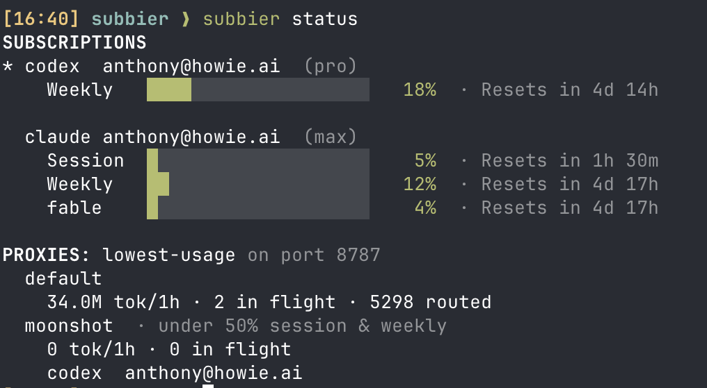
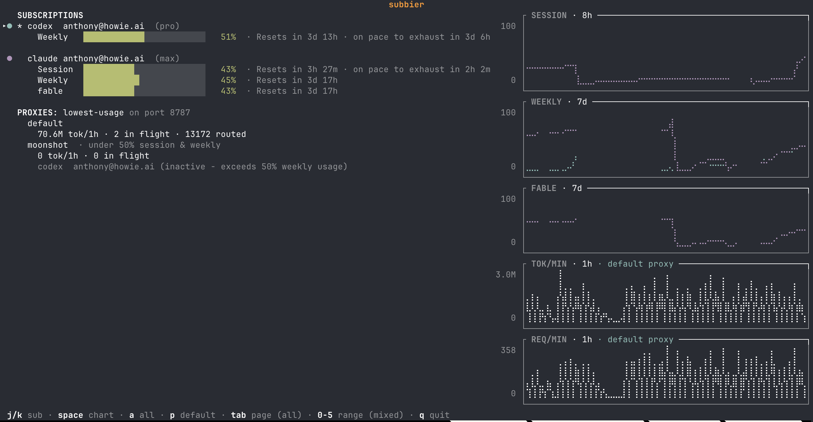

# subbier

Watch your Claude and Codex subscription usage across several accounts. Run
a local proxy that spreads traffic across subs.


_Inspired by [subby](https://github.com/whatupdave/subby/), but even more **subbier**_.

## Install

```sh
# Install `subbier` and `subbier-menubar` in `~/.cargo/bin`
cargo install --git https://github.com/anowell/subbier subbier-cli subbier-macos
# Registers the menu bar app with launchd and starts it
subbier service install
```

Requires [Rust 1.98 or newer](https://rustup.rs/).

## Key Ideas
- **Proxy API requests through codex/claude subs.** A local proxy fronts both
  the Codex Responses API and the Anthropic Messages API.
- **Load balance across accounts.** Route to subscriptions by round-robin,
  lowest usage, highest usage ("drain one before touching the next"), or least
  connections - pinning with cache key or previous response IDs.
- **Proxy pools, when one pool of accounts is not enough.** Create additional
  proxy endpoints that only route to a subset of your subs or that don't route
  to subs that have reached certain usage thresholds. Useful for ensuring
  some ambitious experiments can runaway and consume all your subs.
- **Minimal configuration.** subbier adopts the accounts `codex` and `claude`
  are already logged into. On a machine with both CLIs set up, it works with an
  empty config and no login step.
- **A menu bar item, not a dashboard.** Subscription usage at a glance and
  simple proxy management.

## Usage & Status

Besides the menubar, usage and proxy status are visible via `subbier status` or `subbier watch` (TUI).





## Proxy Usage

If not running, start the proxy with `subbier service start`.
 
Generate an env snippet from the menubar or by running `subbier env`

```sh
eval "$(subbier env)"               # set for current bash/zsh/etc shell
subbier env --shell fish | source   # set for current fish shell
subbier env --provider codex        # just the OPENAI_* pair
subbier env --no-export             # bare KEY=value lines
subbier env --pool moonshot         # only that pool's accounts (see below)
```

## Proxy Pools

A pool is a named subset of your accounts with its own base URL. It exists so
that one piece of work cannot spend what another piece of work needs.
Pools are configurable in `~/.subbier/config.kdl`.

```kdl
pool "moonshot" {
    sub codex  "a@example.com"
    sub codex  "b@example.com"
    max-sub-weekly-utilization 0.5     // skip a member already past half its week
    max-sub-session-utilization 0.5     // skip a member already past half its session
}
```

Point a shell at one and it can reach nothing else:

```sh
eval "$(subbier env --pool moonshot)"
# ANTHROPIC_BASE_URL=http://127.0.0.1:8787/pool/moonshot
# OPENAI_BASE_URL=http://127.0.0.1:8787/pool/moonshot/v1
```
## Upgrading

Upgrading is `cargo install` again, then `subbier service restart`.

## What subbier changes in a request

subbier is a proxy, not a rewriter. However, a few edits are needed; this is all of them.

**Claude — prepend the Claude Code identity block.** Anthropic's OAuth tokens are
issued to Claude Code, and the API only honours them when the `system` array
*begins* with `You are Claude Code, Anthropic's official CLI for Claude.` — the
same string in second place is rejected. subbier prepends it when it is missing
and changes nothing when the client is Claude Code; your own system prompt is
preserved and simply follows. A missing block comes back as a `429` that looks
exactly like a quota error, so subbier classifies that one as request-scoped and
does **not** rotate accounts on it — otherwise one malformed request would burn
the whole pool.

**Codex — normalize for the stateless ChatGPT backend.** `role: "system"` becomes
`"developer"`; `prompt_cache_*` and `max_output_tokens` are dropped; `store:
false` is forced. Upstream is always streamed and reassembled locally when the
client asked for a non-streaming response.

`prompt_cache_key` is read for routing before it is dropped: the strategy picks
an account for the first request carrying a key, and later requests with that key
follow it while it stays usable — moving with a failover, not pinned by a hash —
so the upstream prompt cache stays warm.

**Codex — emulate `previous_response_id`.** That backend keeps no conversation
state, so chains live in `~/.subbier/transcripts.db`: every turn subbier serves
is written down as the items that turn added, and a request naming one of those
ids gets its conversation spliced back into `input`. Chains survive a restart and
are kept for 24 hours or 1 GiB, whichever runs out first. An expired or unknown
id is a 400, never a silently truncated conversation.

Nothing else: no client-fingerprint spoofing, no billing headers, no model-name
rewriting.

## Security

The proxy holds your subscription credentials, so it binds to `127.0.0.1` by
default. Binding anywhere else requires setting `proxy.key`, after which every
request must carry `Authorization: Bearer <key>` (or `x-api-key: <key>`).

Credentials `codex` and `claude` already stored are adopted **read-only** —
subbier never writes refreshed tokens back into `~/.codex/auth.json` or your
Keychain. It does **re-read** them: when a refresh fails because `claude` or
`codex` rotated the token out from under subbier's copy, subbier reads the
source again and adopts whatever is there rather than telling you to sign in to
an account you are already signed in to. Reading is the whole point of adopting;
writing is what it will not do.

## Design docs

- [`docs/ARCHITECTURE.md`](docs/ARCHITECTURE.md) — how it is put together, for changing the code.
- [`docs/PRINCIPLES.md`](docs/PRINCIPLES.md) — the rules it is built to.
- [`docs/MENU-DESIGN.md`](docs/MENU-DESIGN.md) — the macOS menu.

## Development

To build from a checkout:

```sh
cargo build --release          # ./target/release/{subbier,subbier-menubar}
```

## AI

Human-designed, agent-authored, agent-reviewed. Call it slop if you want - useful slop.

## License

MIT
