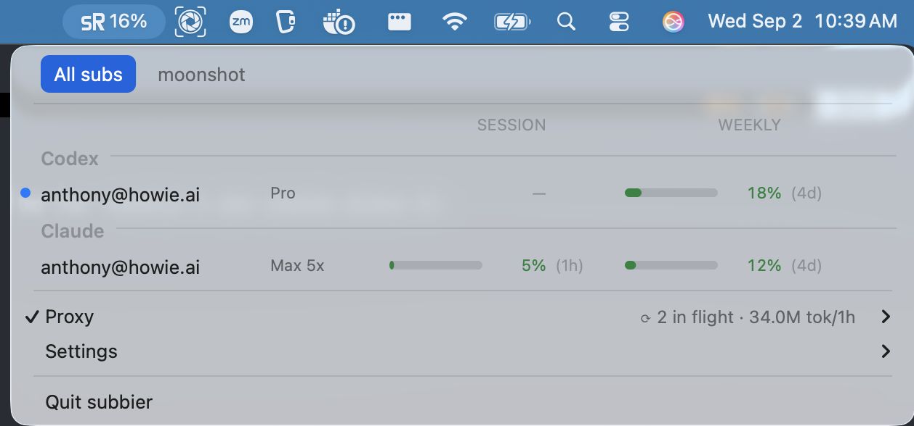

# subbier — the macOS menu

For someone changing `crates/subbier-macos`. The engine behind it is
[`ARCHITECTURE.md`](ARCHITECTURE.md); the rules are
[`PRINCIPLES.md`](PRINCIPLES.md).



## The big picture

The menu is a readout. It answers "how am I doing?" in one look, at one
account or a dozen, and then gets out of the way.

```
 ╭──────────────────────────────────────────────────────────────────────────╮
 │  [ All subs ]  moonshot                                                  │  ← tabs = pools
 │ ──────────────────────────────────────────────────────────────────────── │
 │                                     SESSION           WEEKLY             │
 │  Codex ────────────────────────────────────────────────────────────────  │  ← section = provider
 │  ●  anthony@howie.ai   Pro       ▬▬▬▬▬▭▭▭  67% (4h)  ▬▬▭▭▭▭▭▭  31% (5d)  │  ← one row per sub
 │     spare@example.com  Plus      ▭▭▭▭▭▭▭▭   2% (2h)  ▬▬▬▬▬▬▭▭  74% (3d)  │
 │  Claude ───────────────────────────────────────────────────────────────  │
 │     anthony@howie.ai   Max 20x   ▬▬▬▭▭▭▭▭  31% (1h)  ▬▭▭▭▭▭▭▭   7% (5d)  │
 │     old@example.com    needs login       —                   —           │
 │ ──────────────────────────────────────────────────────────────────────── │
 │  ✓ Proxy                     ⟳ 3 in flight · 4.1M tok/1h               ▸ │  ← everything you can do
 │    Settings                                                            ▸ │
 │ ──────────────────────────────────────────────────────────────────────── │
 │    Quit subbier                                                          │
 ╰──────────────────────────────────────────────────────────────────────────╯
```

Six decisions make it work:

1. **A sub is one row.** Address, plan, session bar, weekly bar. An account
   once cost eight menu items; at twelve accounts that ran off the screen.
   Everything the row cannot fit is in its tooltip.
2. **Tabs are pools.** The strip exists only when a pool is configured, and
   each tab shows both providers, because the question a tab answers is
   "which slice of my accounts", not "which agent".
3. **Rows are not clickable.** Which accounts you are looking at is already
   the tab's answer, so a click on a row has nothing to decide. Every action
   lives in `Proxy ▸` and `Settings ▸`, which are the same in every tab.
4. **Allowance and proxy numbers never share a row.** Bars belong to accounts.
   In-flight and token counts belong to the endpoint and sit on the `Proxy ▸`
   row, showing the selected tab's endpoint.
5. **Colour means one thing.** In the block, a hue is how close to a limit.
   The one accent-coloured dot means "traffic is going here". Nothing else
   is coloured.
6. **The bar's number carries severity.** The icon is a template image and
   cannot be tinted, so the menu bar shows a percentage and a `!` when
   anything is critical.

The rest of this file is the detail behind each.

---

## 1. The row

Every row in the block is a custom view with columns measured in points, and
one view class draws every kind of row so there is one opinion about where
`SESSION` sits. The block is a view rather than styled text because eight
monospaced cells make every value under 12.5 percent the same picture,
AppKit dims disabled text rows, and the system colours only work in dark mode.

| column | contents |
|---|---|
| dot | accent colour, only on the account the proxy is routing to now |
| label | the address, at full strength |
| plan | the resolved tier (`Max 20x`, `Pro`), or the account's problem in its place |
| bar | the allowance, a rounded fill on a quiet track |
| pct | the number, in the bar's band colour |
| reset | `(4h)`, `(3d)`, `(now)`, never in the band colour |

Four drawing rules:

- A window the provider never reported draws `—` and no track. An empty
  track reads as a real zero.
- Anything above zero draws at least a sliver. A 1 percent bar is visible.
- A problem (`needs login`, `exhausted`, `off`) replaces the plan, in the
  warning colour. The plan will still be there tomorrow; the problem is now.
- The reset countdown is never painted in the band colour. Red beside red
  reads as a second warning.

The provider section is a name and a hairline to the edge. Its job is to
divide: with a dozen accounts, "where does Codex end" must be answerable
without reading. It carries no metrics and no control.

**The tooltip** holds what the compact row dropped: the vendor's own plan
name when it differs from the resolved tier, full "resets in 4h 41m"
countdowns for each window, and whether the proxy is routing here. A health
problem replaces the countdowns.

## 2. Tabs

One menu item at the top carries a custom view, the tab strip. Every other
row is a stock row whose hidden flag is driven by the selected tab. Each tab
owns a complete set of rows, hidden until selected, because a pool tab shows a
different subset under the same section headers.

A click on the strip flips hidden flags, repaints, and returns without
cancelling tracking, so the menu stays open and re-lays itself out under the
cursor. Selection survives a refresh.

The open menu repaints on a timer registered in the event-tracking run loop
mode. That is the only execution context that runs while a menu is open;
work dispatched to the main queue waits until the menu closes.

A tab pill says just the name. A live badge on it changed the pill's width
every few seconds and moved the thing you were about to click.

## 3. The two submenus

**`Proxy ▸`** is what the proxy is doing: copy env snippet, the four
strategies, the two per-provider switches, and `Disabled` as the off position
of the strategy list. Strategies are flattened in rather than nested, because
they are the menu's most-used control. The env snippet lives here rather than
next to `Quit` because it is *this endpoint's* snippet: on a pool tab, that
pool's URLs.

**`Settings ▸`** is app-level: notifications, launch at login, menu bar
style, add account, edit config, refresh now. Editing the config is not an
engine command. Opening a file is the frontend's business, and the engine
watches the file so a save takes effect without a restart.

## 4. Colour

Severity is read straight off the snapshot, so the menu cannot disagree with
`subbier status` about what is alarming. Each band is a pair of colours, one
per appearance, chosen inside the draw call where AppKit has already made the
row's appearance current. A system-wide light/dark switch repaints with
nothing to observe. The system colours were not used because they are tuned
for dark surfaces and are nearly invisible on a light menu.

The menu bar title is never coloured. Attributing the status item's title
makes the plain title setter a silent no-op and fights menu bar tinting, for
nothing the `!` does not already say.

## 5. Three traps in the menu toolkit

All three shape every file under `menu/`:

1. **An attributed title beats a plain one.** Once a row carries an
   attributed title, setting its plain text is a silent visual no-op. Such a
   row is updated through the attributed setter forever, or handed back
   explicitly.
2. **Every insert builds a fresh native item.** Anything applied through the
   native hatch (views, tooltips, hidden flags, attributed titles) is lost on
   rebuild. Each row is painted in the same loop that inserts it, at the index
   it was just given. Nothing caches a native item across a rebuild.
3. **Never find a row by title.** The row-to-tab map is positional, aligned
   with the native menu. An early prototype that matched on title hid its own
   tab strip.

## 6. Where the code sits

Everything here is main-thread-only and lives in one thread-local. The engine
runs on a background tokio thread; each new snapshot is hopped to the main
thread and applied. The menu's structure is built once; a snapshot only moves
text, checkmarks and what a row draws.

The macOS app calls the library's formatting helpers for percent, duration
and token counts. Fonts, colours, geometry, tooltips and hidden-row
bookkeeping are macOS-only and stay that way. A frontend on another platform
reads percent and severity off the snapshot and picks its own.
